# cQube
cQube is an open-source platform for creating data-based insights in the field of education. It provides flexibility, scalability and ease of use in creating dashboards for actionable insights while also enabling power-users to create customized insights. It is built modularly on top of mature open source tools providing for extensibility and further customization.


<h1>Installation of CQube</h1>
<h3>For Linux</h3>

- Open Terminal
- Navigate to the directory where CQube has been downloaded or cloned 
```
cd cQube/ansible/installation_scripts/
```
- Give the permission to install.sh file
```
chmod u+x install.sh
```
- Run the install.sh shell script file using sudo command
```
sudo ./install.sh
```
This script sets up the infra in a sequence as mentioned below:
  - Installs Ansible
  - Installs Openjdk
  - Installs Python3 and Pip
  - Installs Apache Nifi
  - Creates S3 buckets
  - Installs and configures SFTP
  - Installs Postgresql
  - Installs Node.js and Express framework

Once installation completed without any errors, you will see the following message. 
```CQube installed successfully!!``` 

If script fails anywhere, scripts stops and you will be shown with appropriate error message in red color.

<h4>Post Installation Configuration</h4> 

<b>Nifi Configuration</b>

Nifi Parameters:

S3-INPUT-BUCKET
S3-OUTPUT-BUCKET
S3-ACCESS-KEY
S3-SECRET-KEY
SFTP-HOSTNAME 
SFTP-INPUT
SFTP-PORT
SFTP-USER 
SFTP-PWD 
POSTGRE-DRIVER-DIR 
POSTGRE-DRIVER-CLASS-NAME
POSTGRE-CONNECTION-URL
POSTGRE-SOURCE-DB = cqubedev
POSTGRE-DTN-DB = cqubedev
POSTGRE-DB-USER
POSTGRE-PWD 

Nifi will be accessible on `http://<your_hostname>:8080/nifi`

<b>Note: Make sure Port 8080 is open in firewall</b>

  1. Click `Templates` options 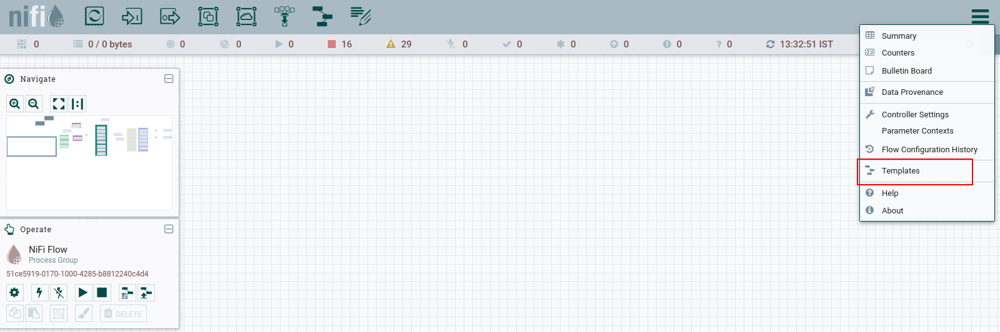
  2. You will see the template in `NiFi Templates` list 
  3. Next step is Instantiating template. Click and Drag the template icon as shown below 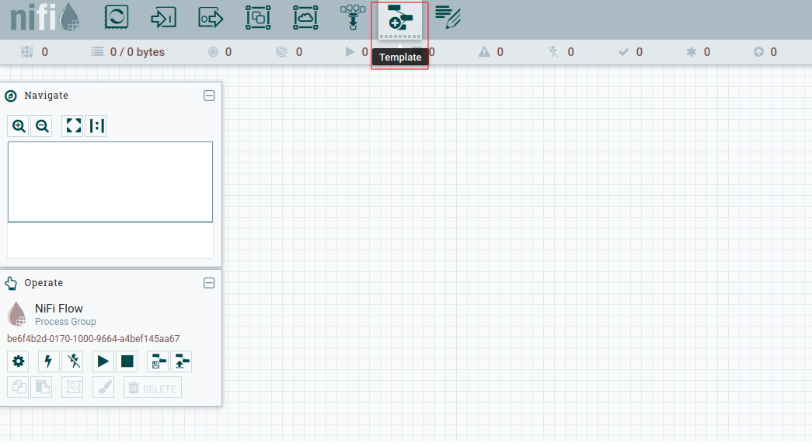
  4. Click on the drop down list and select the `CQube-ver-0.1` template. 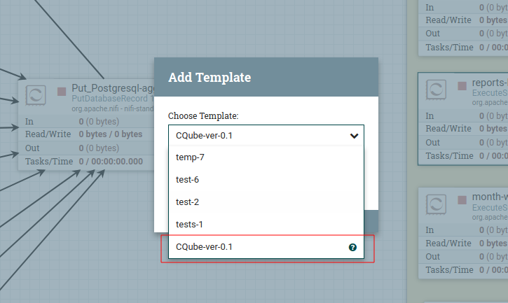
  5. Click 'ADD' button and template will be added to canvas. 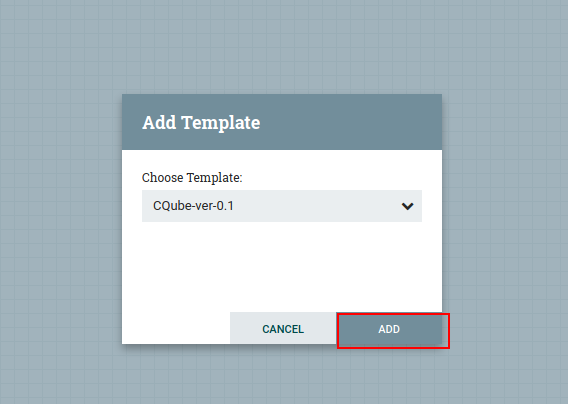
  6. Double click on the `cQube Processor Group` to enter the group. 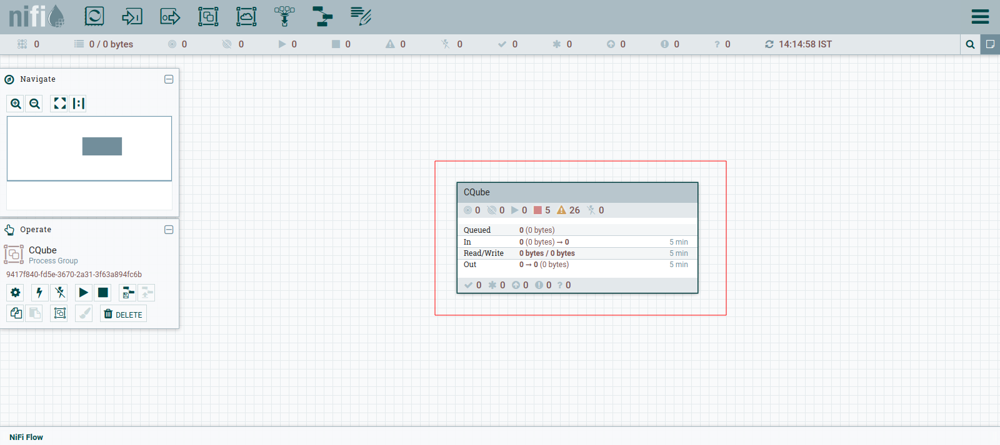
  7. Right click on the canvas and Select `Parameters` option.  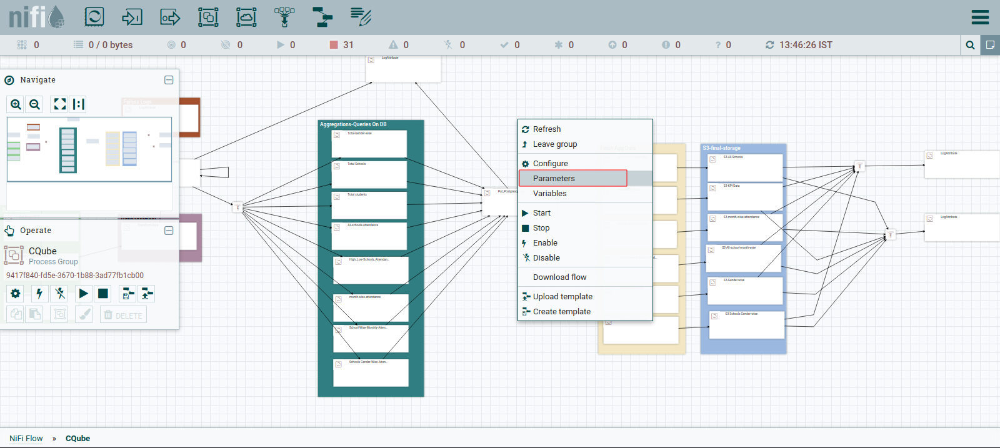
  8. Click the `+` icon to add Parameter Context 
  9. Enter the Name as `ENVIRONMENT VARIABLES` and Click on  `PARAMETERS` tab 
  10. Click on `+` icon to add the cQube configuration parameters 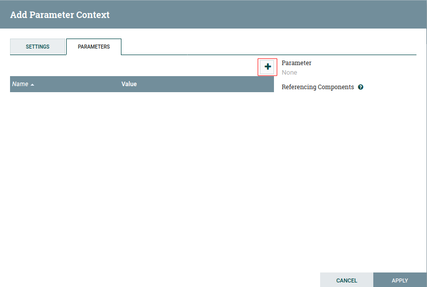
  11. Enter the Name and Value and Click Apply to add the parameter 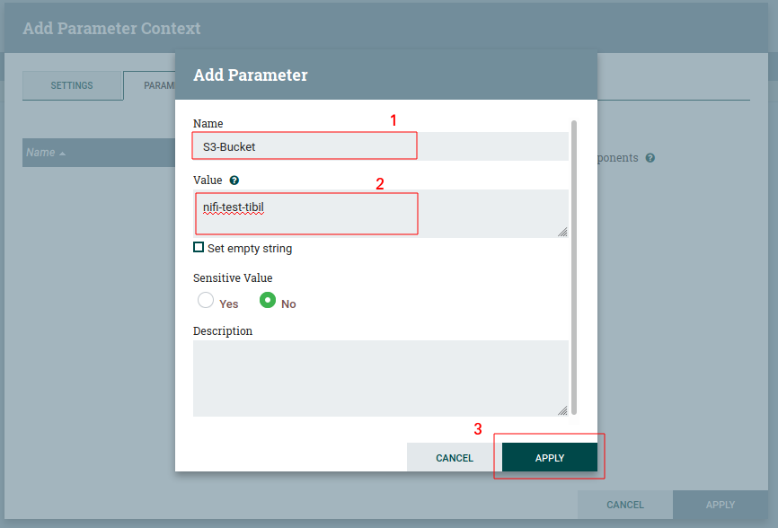
  12. Below is an example to add the parameter with Sensitive Value 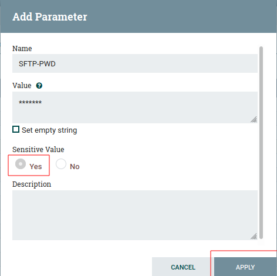
  13. Once you click Apply, you will see List of parameters which you added. Repeat the step 14 to 16 to add the above mentioned parameters. Finally click on `Apply` button. 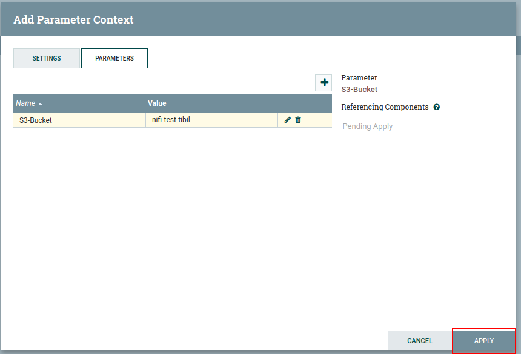
  14. Once you click Apply, you will see list of Nifi Parameter Contexts 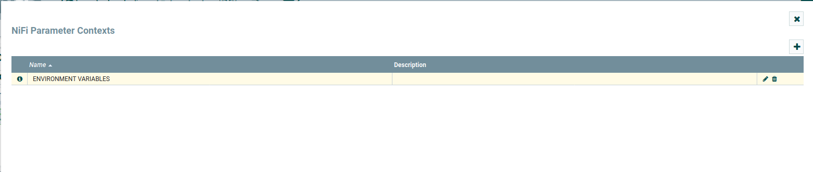
  15. Next step is to link the Parameter Context to cQube Processor Group. Click on Settings icon on Operate palette 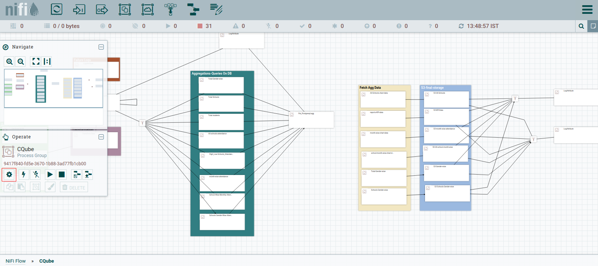
  16. Under `General` tab, click the drop down of Process Group Parameter Context and select the `ENVIRONMENT VARIABLES` and click Apply 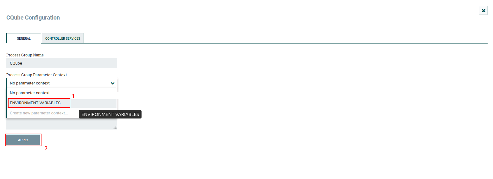
  17. Once successfully applied, you will be prompted as shown below. Click on OK 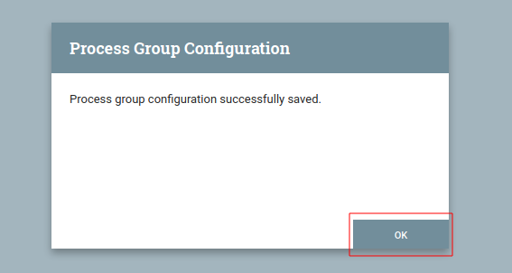
  18. Click on `CONTROLLER SERVICES` tab to enable Controller services 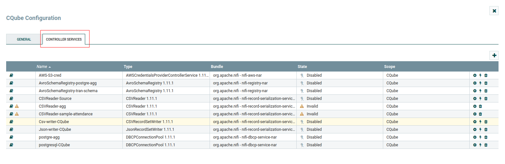
  19. Click on `Enable` icon as shown 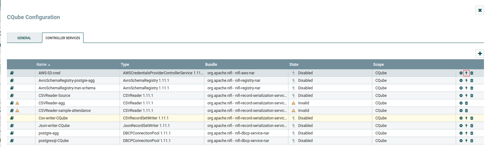
  20. Then click on `ENABLE` button 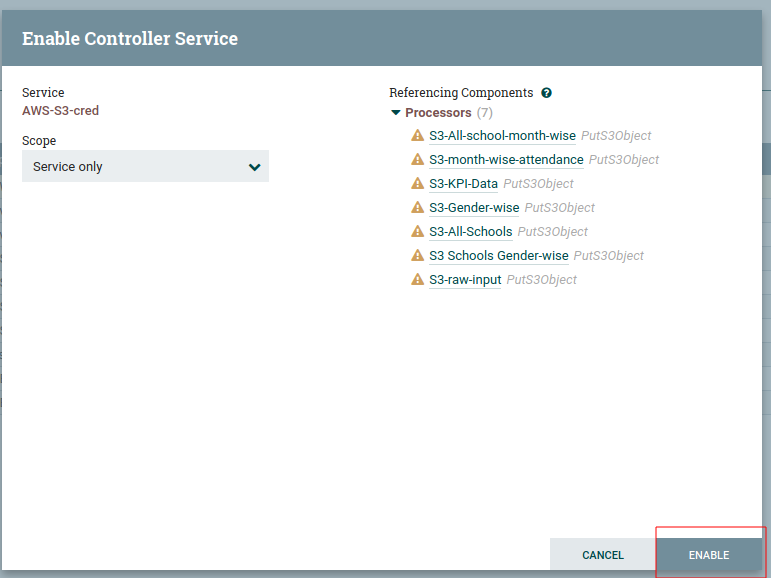
  21. Once its enabled successfully, you can see the green Tick mark as shown below 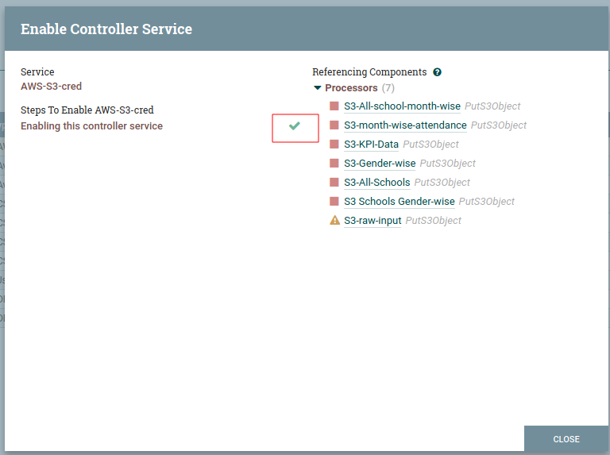
  22. Repeat steps 24 to 26 to enable all Controller Services and close the cQube Configuration window 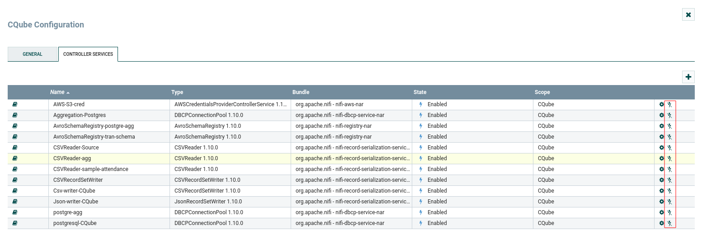
  23. Right click on canvas and select `Start` to start the Processor Group 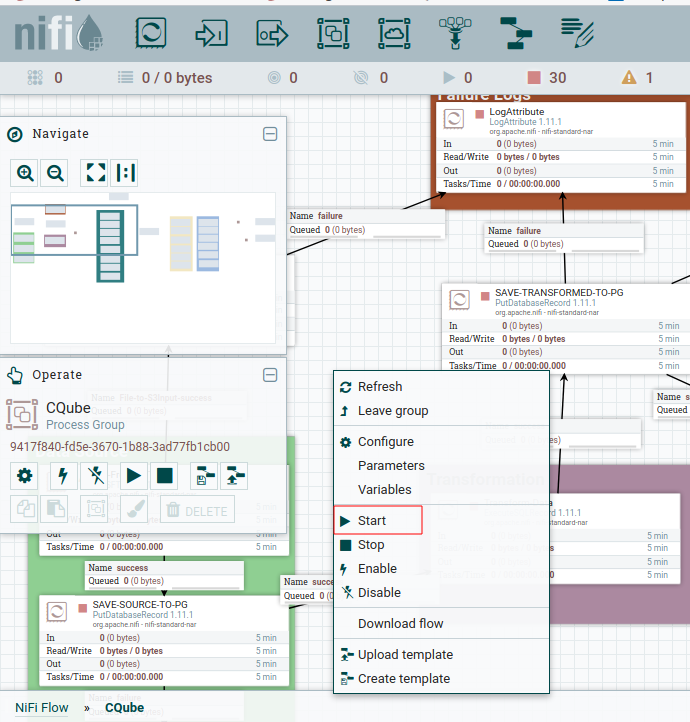
  24. Once all Processors started, you will see Green Play icon in all processors 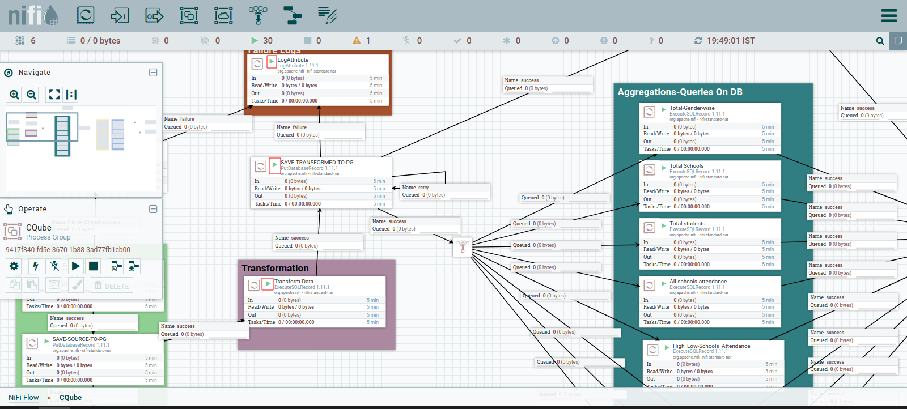
  
  


For Windows:
-----------

To install in Windows Machine use
./install.bat

--------To Do--------------------
