<h1>Installation of CQube</h1>
<h3>For Linux</h3>

- Open Terminal
- Navigate to the directory where CQube has been downloaded or cloned 
```
cd cQube/ansible/installation_scripts/
```
- Give the permission to install.sh file
```
chmod u+x install.sh
```
- Run the install.sh shell script file using sudo command
```
sudo ./install.sh
```
This script sets up the infra in a sequence as mentioned below:
  - Installs Ansible
  - Installs Openjdk
  - Installs Python3 and Pip
  - Installs Apache Nifi
  - Creates S3 buckets
  - Installs and configures SFTP
  - Installs Postgresql
  - Installs Node.js and Express framework

Once installation completed without any errors, you will see the following message. 
```CQube installed successfully!!``` 

If script fails anywhere, scripts stops and you will be shown with appropriate error message in red color.

<h4>Post Installation Configuration</h4> 

<b>Nifi Configuration</b>

Nifi will be accessible on `http://<your_hostname>:8080/nifi`

<b>Note: Make sure Port 8080 is open in firewall</b>

  1. Click on 'Upload Template' icon from the Operate Palette sits to the left-hand side of the screen as shown below 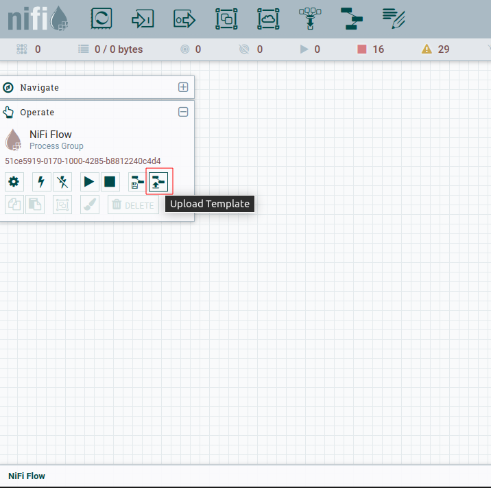
  2. Select the Template file `CQube-ver-0.1.xml` from `cQube/development/nifi` directory <br>Note: If you installed the NiFi in remote machine and viewing the NiFi UI in local machine, make sure you download or clone the same repository to local. 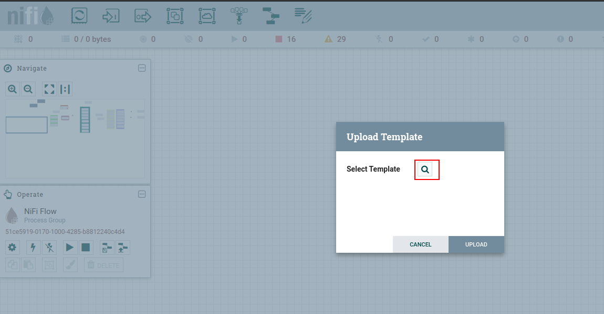
  3. Click on Upload button as shown below 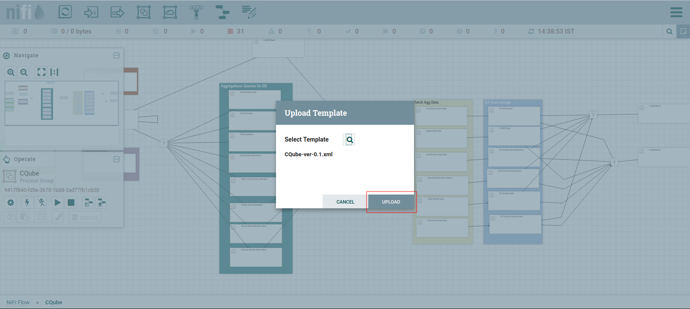
  4. Once uploaded succcessfully, you will be prompted with following pop-up. Click 'OK'. 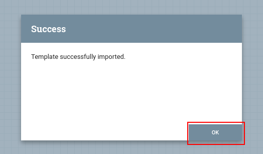
  5. To verify the uploaded template, Click `Templates` options 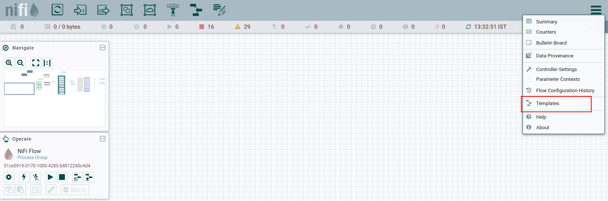
  6. You will see the template in `NiFi Templates` list 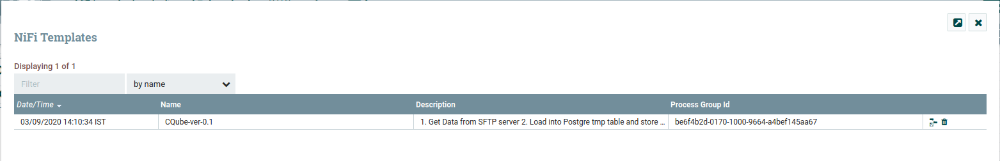
  7. Next step is Instantiating template. Click and Drag the template icon as shown below 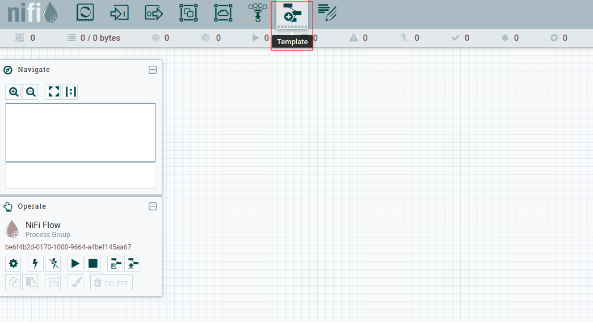
  8. Click on the drop down list and select the `CQube-ver-0.1` template. 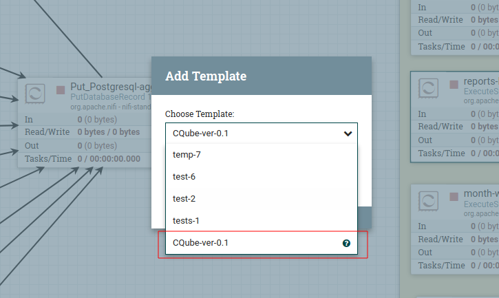
  9. Click 'ADD' button and template will be added to canvas. 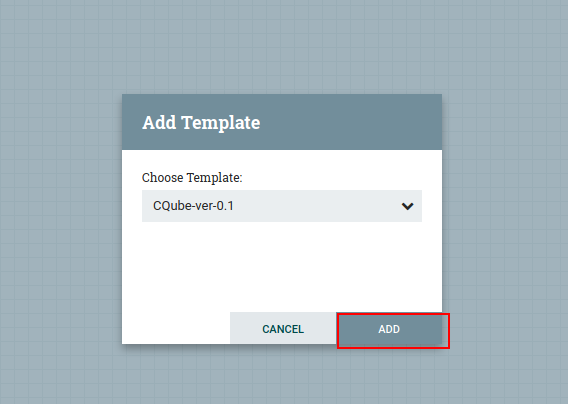
  10. Double click on the `cQube Processor Group` to enter the group. 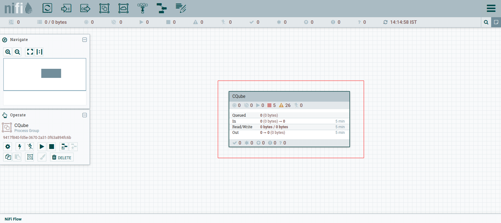
  11. Right click on the canvas and Select `Parameters` option.  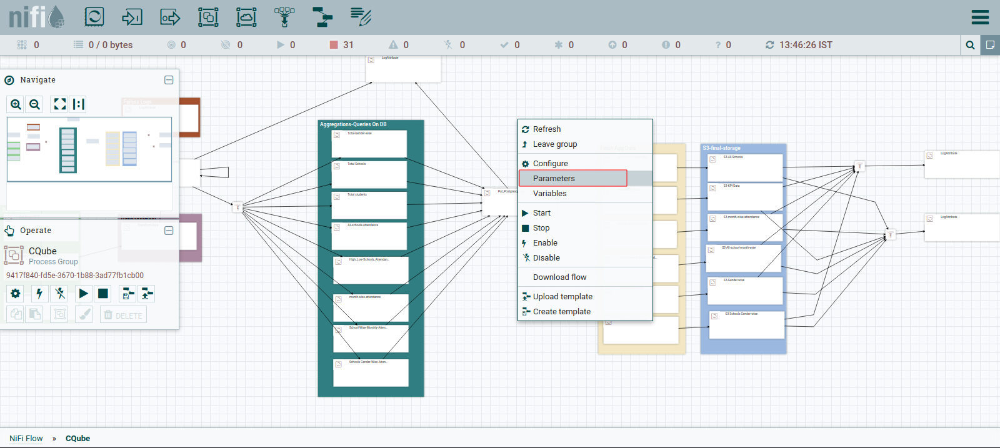
  12. Click the `+` icon to add Parameter Context 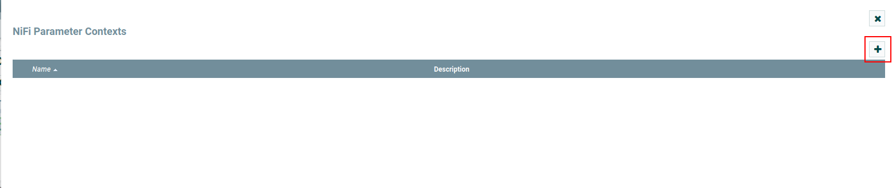
  13. Enter the Name as `ENVIRONMENT VARIABLES` and Click on  `PARAMETERS` tab 
  14. Click on `+` icon to add the cQube configuration parameters 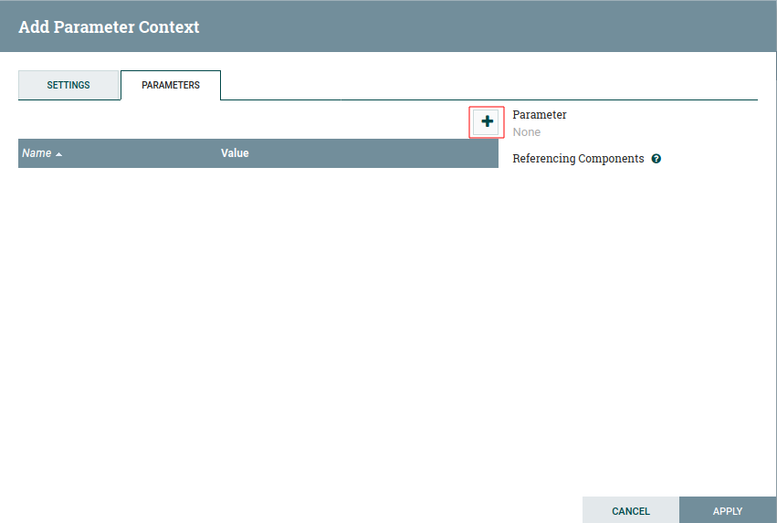
  15. Enter the Name and Value and Click Apply to add the parameter 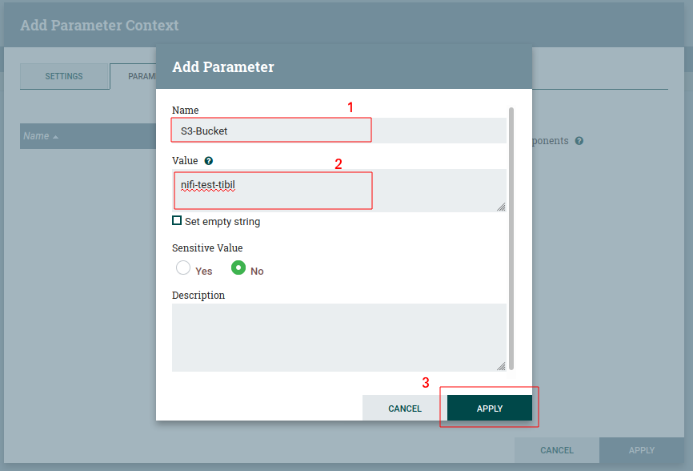
  16. Below is an example to add the parameter with Sensitive Value 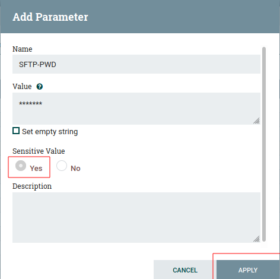
  17. Once you click Apply, you will see List of parameters which you added. Repeat the step 14 to 16 to add the below mentioned parameters. Finally click on `Apply` button. 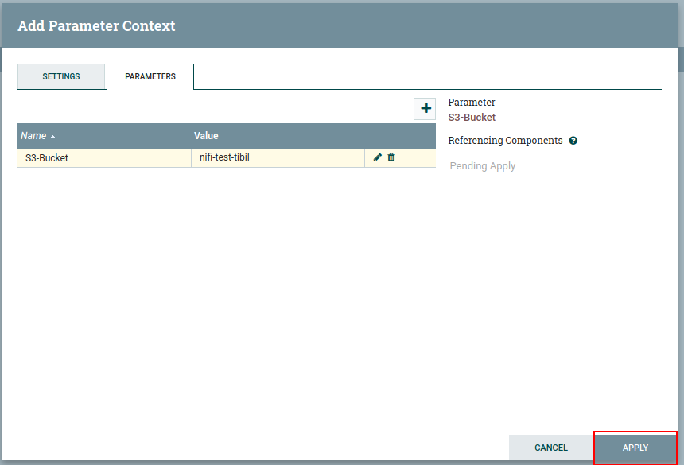
  18. Once you click Apply, you will see list of Nifi Parameter Contexts 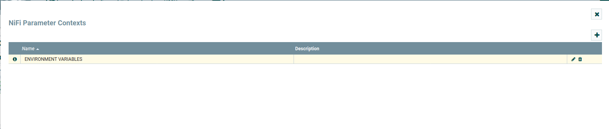
  19. Next step is to link the Parameter Context to cQube Processor Group. Click on Settings icon on Operate palette 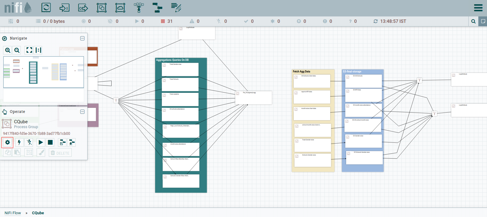
  20. Under `General` tab, click the drop down of Process Group Parameter Context and select the `ENVIRONMENT VARIABLES` and click Apply 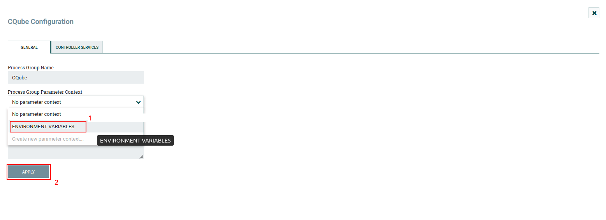
  21. Once successfully applied, you will be prompted as shown below. Click on OK 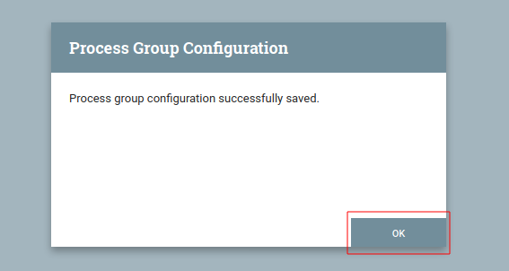
  22. Click on `CONTROLLER SERVICES` tab to enable Controller services 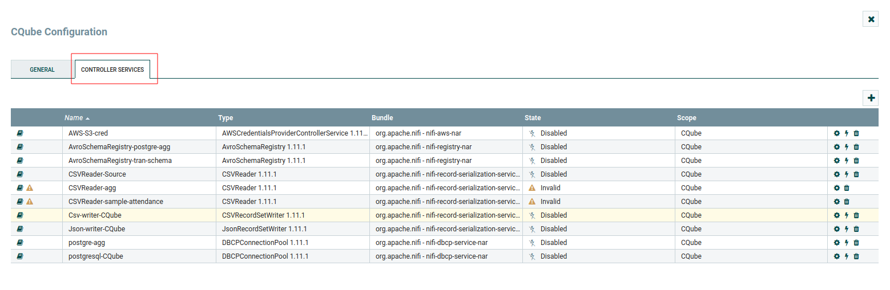
  23. Click on `Enable` icon as shown 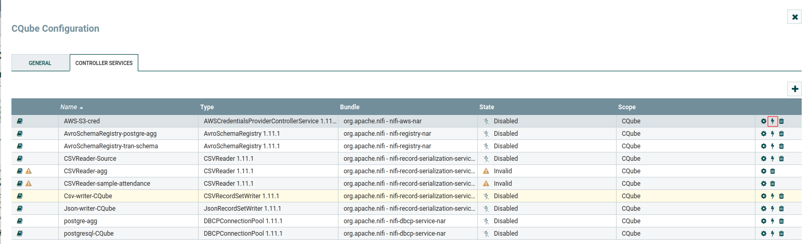
  24. Then click on `ENABLE` button 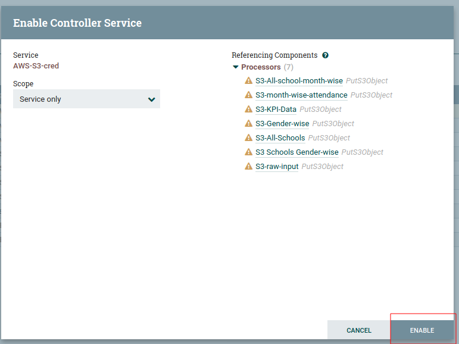
  25. Once its enabled successfully, you can see the green Tick mark as shown below 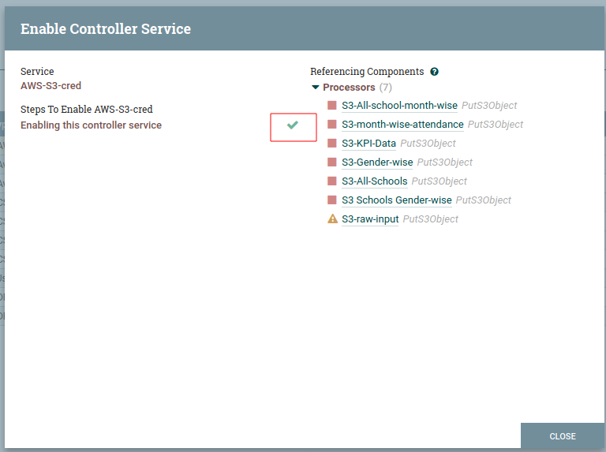
  26. Repeat steps 24 to 26 to enable all Controller Services and close the cQube Configuration window 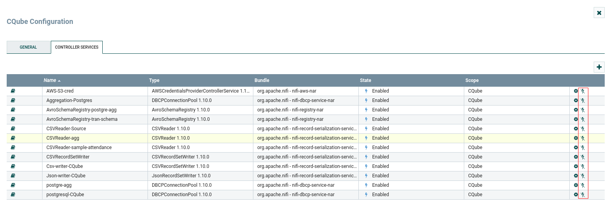
  27. Right click on canvas and select `Start` to start the Processor Group 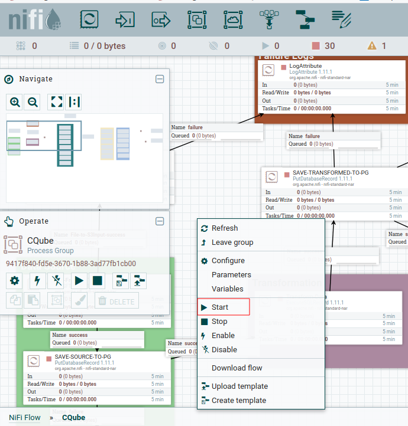
  28. Once all Processors started, you will see Green Play icon in all processors 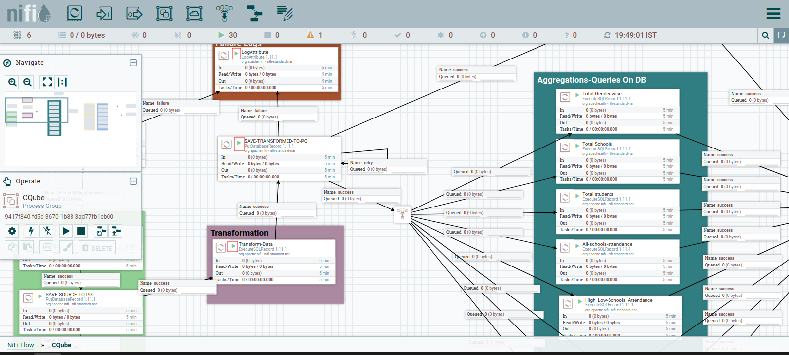
  
  


For Windows:
-----------

To install in Windows Machine use
./install.bat

--------To Do--------------------
